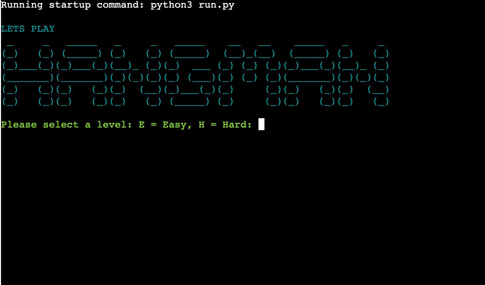
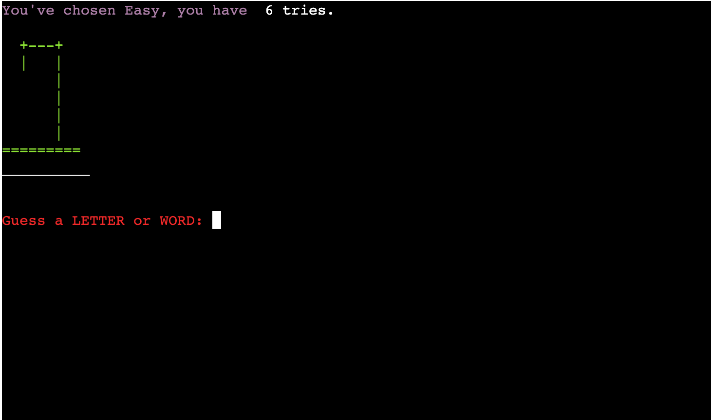
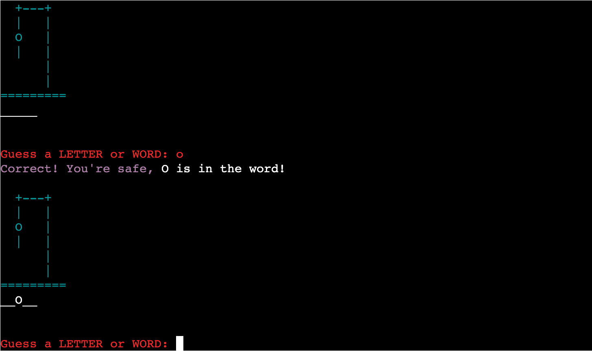
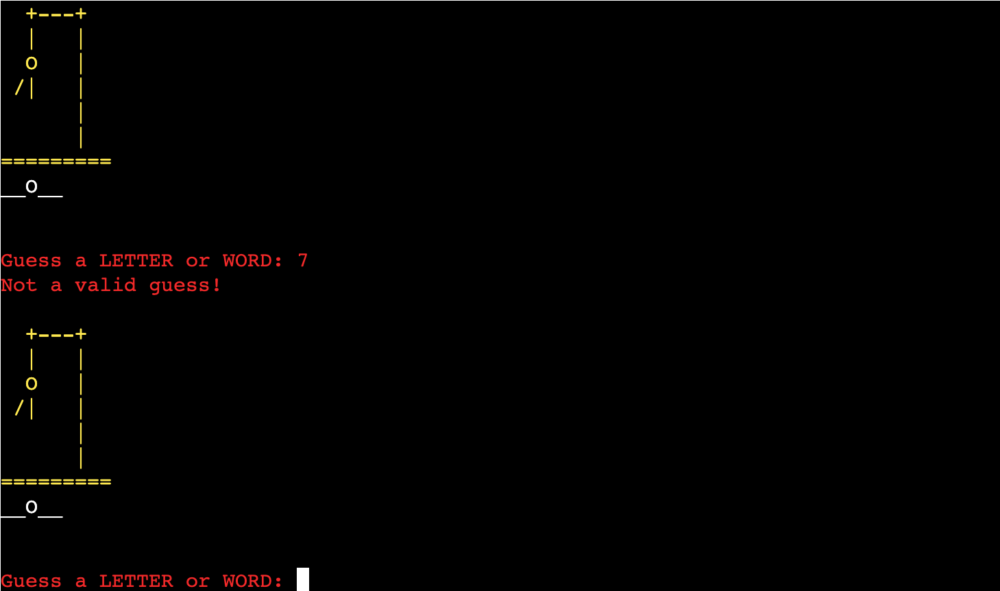
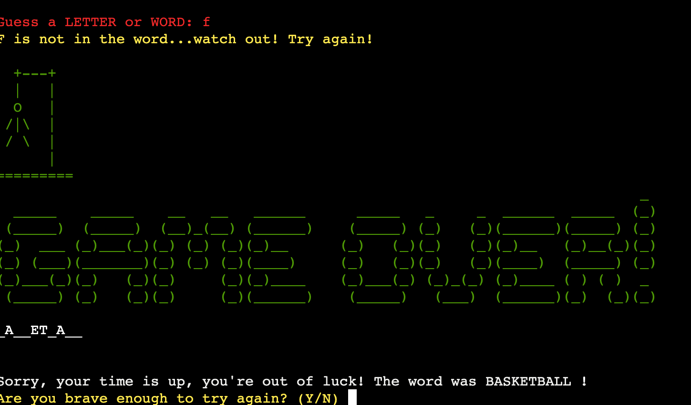

# HANGMAN
# Portfolio Project 3
 
Hangman is a Python terminal game, which runs in the Code Institute mock terminal on Heroku. It is a fun game aimed at any English speaking individual or English student. This game can be played at any time for fun or as a brain game.
 
The game can be found [here](https://hangman-p3-evie.herokuapp.com/).
 

 
## How to play
----
- The game begins with a welcome message. The image was generated using the Ascii graffiti generator [PatorJK.](http://patorjk.com/software/taag/#p=display&h=1&v=2&f=Pawp&t=Hangman) I ensured the style is easy to read.
 

 
- The game then asks the user to choose a difficulty level. They can select Easy by pressing "E" or Hard by pressing "H" on the keyboard. Easy gives the user 6 tries and Hard gives the user 4 tries, to guess the word. If the user tries to input any other key the game will not accept it and will ask the question again.
 

 
- The game provides an image of the empty gallows with a line of underscores underneath it. This shows the length of the word. The game asks the user to guess a letter or word.
 
- The user begins by picking a letter. If they guess correctly, the letter appears on screen in its respective place in the word. The console also provides positive feedback telling the user they are correct. It then prompts the user to input another letter.
 

 
- The player continues to guess letters. If incorrect, a body part appears in the gallows and the console feeds back to the user saying the letter is not in the word and to try again.
 

 
- If the user should guess a letter again, that they already guessed, the console will tell them they already guessed that letter. The player does not lose a life and is prompted to guess again.
 

 
- If the player inputs a guess that is not a letter or word. The computer will feedback that it is not a valid guess and try again. The player will not lose a life.
 

 
- If the player guesses each letter correctly or figures out the word and types it in before they run out of tries and all the body parts appear in the gallows, they are congratulated for guessing the word correctly.
 

 
- If the player runs out of tries and they don't guess the word, they get a game over message and the computer reveals the word. The user is asked whether they would like to play again after each game.
 

 
## Flowchart
 
This is my initial plan for the game. Some features have changed as I developed the game.
 

 
## Features
----
- Random word selection
 * The computer randomly selects a word from the word list.
 * The player cannot access this word, only see the length and input word or letter guesses.
 
- The user plays against the computer
 
- The computer accepts user input and gives responsive feedback
 
- Input validation and error-handling
 * You cannot enter a number.
 * You cannot enter a string of letters that isn't equal to the length of the word.
 * You cannot enter the same guess twice.
 
## Testing
----
### Code Validation
- I tested my code using pycodestyle that i installed into GitHub. I had to fix 'line too long' and 'whitespace' errors. Otherwise there were no errors detected.

### Manual Testing
- At the start of the game the player must select a level. E for Easy or H for Hard. These are the only two letters the computer should accept.
- Test: To test this, I input the E and H individually, both upper and lower case. I then tried other letters, words, numbers and punctuation keys to see if the game would continue.
- Result: Adding anything except E or H did not continue the game and the console told the user that their input was not a difficulty and re-asked the question to select E or H.
- Verdict: Only E and H were accepted so it was a success.
----
- The user should only be able to guess a single letter or a word that equals the length of the word they are trying to guess. Any number, punctuation mark or word that is longer or shorter than the one to be guessed should not be accepted.
- Test: After starting the game and selecting a difficulty, I input words that were longer or shorter than the length of word I was trying to guess, I input numbers and I input symbols.
- Result: The game did not allow the player to add any symbols, numbers or words that did not equal the correct length. It told the user their input was incorrect and asked them to guess again.
- Verdict: Only singular letters or words of the correct length were accepted as guesses and allowed the game to continue. The test was a success.
----
- The user should only be allowed to guess each letter/word once. If it is already guessed the computer should tell them and they do not lose a life.
- Test: Whilst playing the game I repeatedly input the same letter/word.
- Result: The computer prompted me that I had already guessed that letter/word and should try again. No life was lost.
- Verdict: This test was a success as the game prompted the user with a message and no life was lost.
----
- When the user loses a game, "Game Over" should appear with a message to inform the player of the word they were trying to guess.
- Test: I played the game multiple times trying to guess incorrectly so as to lose.
- Result: Each time I lost the message popped up correctly at the end of the game.
- Verdict: The test was a success. The message appeared correctly at the correct point in the game.
----
- When the user wins a game, "Well Done" should appear to congratulate the player.
- Test: I played the game multiple times trying to win.
- Result: By winning as many times as I could, the message came up at the end of the game.
- Verdict: The test was a success. Each time I won the game the correct message was displayed at the correct time.
----
- When the user finishes the game, whether they win or lose, the game should ask them if they want to play again. The player can input Y for yes or N for no. If they select Y the game should restart, if they select N the terminal clears and the game ends.
- Test: By finishing the game repeatedly I input Y or N to test the outcome.
- Result: Y restarted the game, N cleared the terminal and any other key was not accepted.
- Verdict: The test was a success as the appropriate key carried out the correct function.
 
### Bugs
- Problem: The Y/N option to restart the game was not working. It just cleared the console.
- Cause: I had put an if in a while loop. And I had forgotten to put parentheses after the .upper “"Are you brave enough to try again? (Y/N) ").upper() == "Y":”
- Resolution: I reformatted my while statement and added in my parentheses. The function then worked.
 
 
## Technologies
----
### Languages
- [Python:](https://www.python.org/) This whole project was written using Python.
- [Markdown:](https://www.markdownguide.org/basic-syntax/) The READ ME is written using Markdown.
 
### Environment
- [GitHub:](https://github.com/) was used to host the code.
- [GitPod:](https://www.gitpod.io/?utm_source=googleads&utm_medium=search&utm_campaign=dynamic_search_ads&utm_id=16501579379&utm_content=dsa&gclid=EAIaIQobChMIn6TCrsyA-wIVDNPtCh319wDpEAAYASAAEgKK2vD_BwE) was used to write the code.
- [Heroku:](https://id.heroku.com/login) was the cloud hosting platform used to deploy this project.
 
### Packages
- [Colorama:](https://pypi.org/project/colorama/) was used to create coloured text and images in the game.
 
### Other
- [Graffiti:](http://patorjk.com/software/taag/#p=display&h=1&v=2&f=Pawp&t=Hangman)was used for the large text images in the game.
 
## Deployment
----
- I committed and pushed all code for the game to GitHub from GitPod.
- I created an account on [Heroku](https://id.heroku.com/login).
- I clicked on 'New' and clicked 'Create New App'.
- I then chose the correct region, Europe and created a name for my app.
- In settings I sorted out the Buildpacks for everything to work.
- I inputted the python and nodejs buildpacks.
- I then put in the config var PORT 8000.
- I then clicked on the deploy page and linked my GitHub repo with the Heroku app.
- I then deployed the branch at the bottom of the page, ensuring no errors occurred.
- I enabled automatic deploys so if I edit and push the code to GitHub, Heroku automatically updates and redoploys.
- I then opened the game on Heroku to ensure it functions efficiently and checked for any errors that may have occurred.
 
## References
----
- I watched multiple tutorials on YouTube to understand the basics of Hangman code in Python. The [Kite](https://www.youtube.com/watch?v=m4nEnsavl6w) was especially helpful and helped me to understand the what and why of my code.
- I used [Random Words Generator](https://randomwordgenerator.com) to get my words for the game. I was able to tailor the length and chose 50 words for each length.
 
## Acknowledgements
----
- I'd like to thank my mentor Richard Wells for all of the help and support throughout.
- Thank you to my family and friends for testing and feedback.
- Thank you to my peers on Slack for always being supportive.

Evangeline MIlls 2022